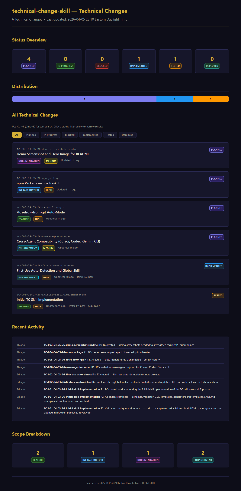
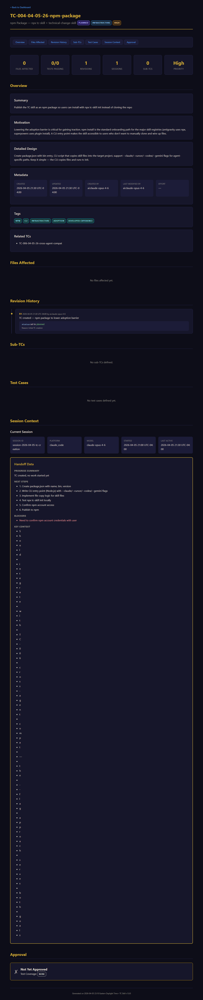

# TC (Technical Change) Skill

A structured code change tracking system for [Claude Code](https://claude.ai/claude-code). Documents every code change with JSON records and accessible HTML output, enabling AI bot sessions to seamlessly resume work when previous sessions expire or are abandoned.





## What It Does

- **Tracks every code change** with structured JSON records (what, why, who, when)
- **AI session handoff** — when a bot session expires, the next one picks up exactly where it left off
- **Accessible HTML output** — dark theme, WCAG AA+ compliant, rem-based fonts for low-vision users
- **State machine** — enforces a strict lifecycle: Planned > In Progress > Blocked > Implemented > Tested > Deployed
- **Test cases with evidence** — structured test protocols with log snippet proofs
- **Dashboard** — CSS-only filterable overview of all TCs in a project (no JavaScript required)
- **Cross-project** — deploy to any project with `/tc init`

## Quick Start

### Claude Code (default)

```bash
# Clone and install as a skill
git clone https://github.com/Elkidogz/technical-change-skill.git ~/.claude/skills/tc
```

Then in any project: `/tc init` to set up tracking, `/tc create <name>` to start.

### Cursor

```bash
git clone https://github.com/Elkidogz/technical-change-skill.git .cursor/skills/tc
```

Invoke with `/tc` or `@tc` in Cursor's agent.

### Codex CLI (OpenAI)

```bash
git clone https://github.com/Elkidogz/technical-change-skill.git .agents/skills/tc
```

Reference with `$tc` or via `/skills` listing.

### Gemini CLI (Google)

```bash
git clone https://github.com/Elkidogz/technical-change-skill.git .gemini/skills/tc
```

Gemini auto-activates skills based on context — no manual trigger needed.

### GitHub Copilot

```bash
git clone https://github.com/Elkidogz/technical-change-skill.git .github/skills/tc
```

Invoke with `/tc` or via `/skills` command.

## Commands

| Command | Description |
|---------|-------------|
| `/tc init` | Initialize TC tracking in the current project |
| `/tc create <name>` | Create a new TC record for a functionality |
| `/tc update <tc-id>` | Update a TC (status, files, tests, notes) |
| `/tc status [tc-id]` | View status of one or all TCs |
| `/tc resume <tc-id>` | Resume work from a previous session's handoff |
| `/tc close <tc-id>` | Transition to deployed + final approval |
| `/tc export` | Regenerate all HTML from JSON records |
| `/tc dashboard` | Regenerate the dashboard index.html |
| `/tc retro` | Bulk-create TCs from git history or changelog |

## TC Naming Convention

```
TC-NNN-MM-DD-YY-functionality-slug     (parent TC)
TC-NNN.A                                (sub-TC revision A)
TC-NNN.A.1                              (sub-revision 1 of revision A)
```

## State Machine

```
planned --> in_progress --> implemented --> tested --> deployed
   |             |               |            |          |
   +-> blocked <-+               +-> in_progress <------+
        |                            (rework/hotfix)
        +-> planned
```

Every transition requires a reason and is recorded in the append-only revision history.

## Per-Project Structure

When you run `/tc init`, it creates:

```
{project}/docs/TC/
  tc_config.json          Project settings
  tc_registry.json        Master index of all TCs
  index.html              Dashboard with metrics
  records/
    TC-001-04-03-26-name/
      tc_record.json      System of record
      tc_record.html      Human-readable (generated)
  evidence/
    TC-001/               Log snippets, screenshots
```

## Skill Structure

```
TC/
  SKILL.md                Skill definition (8 commands + auto-detection rules)
  schemas/                JSON Schemas for records, registry, config
  validators/             Python state machine + schema validation
  generators/             Python HTML generators (stdlib only)
  templates/              Accessible CSS + HTML templates
  init/                   CLAUDE.md and settings templates for project onboarding
  examples/               Complete worked examples
```

## Key Design Decisions

- **Python stdlib only** — zero external dependencies, runs anywhere Python 3.10+ exists
- **CSS-only interactivity** — dashboard filters work without JavaScript, files open from `file://` URLs
- **Append-only history** — revision entries are never modified or deleted
- **Self-contained HTML** — CSS is inlined into every generated page
- **Accessible** — WCAG AA+ contrast ratios, rem-based sizing, skip links, aria labels, print stylesheet

## Accessibility

All generated HTML is designed for low-vision users:
- Dark theme with high contrast (13:1+ body text, 7:1+ code text)
- All sizing in `rem` — scales with browser font size / Ctrl+Plus zoom
- Skip links and keyboard navigation support
- Semantic HTML with aria labels
- Print stylesheet (white background, dark text)

## License

MIT
